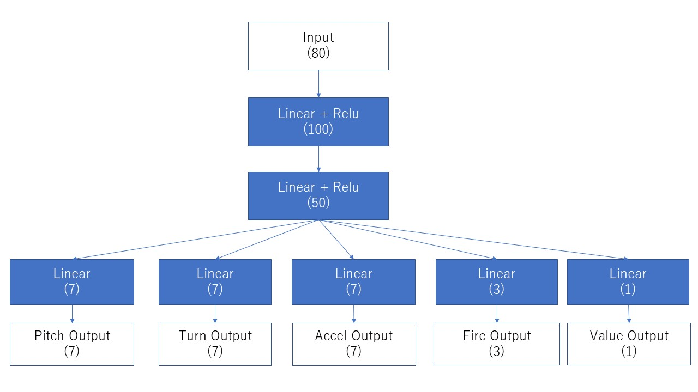

# 空戦AIチャレンジ、深層強化学習チュートリアル

## 概要

本コンペティションの強化学習を利用した戦闘機エージェントを作成する方法を掲載した。
## 強化学習を利用して学習したエージェントの作成と提出

### 本チュートリアルの概要

強化学習ライブラリHandyRL（https://github.com/DeNA/HandyRL）を用いて学習し、
そのモデルを用いて提出するまでの流れを記述した。

### HandyRLを利用した強化学習エージェントの作成

HandyRLを利用した強化学習のエージェントを作成する。
本章で定義した構成は次の通り。以下の内容は「handyrl/envs/nishika/env.py」に実装している。

#### ニューラルネットワーク

1. 出力が5つのMLP（2層、Linear + ReLU）、出力は4つの行動（Turn/Pitch/Accel/Fire）とゲームの価値を示すもの。
   サンプルのニューラルネットワークの図面は次の通り。図中の（）は出力の次元を示す。
   

#### 特徴量

1. R3PyAgentSample01で取得できる特徴量を利用している。

#### 環境

1. 2 vs 2（Blue/Red）の対戦、開始地点はランダムに生成される。
2. 戦闘機はそれぞれ単独の情報で操作しており、連携していない。
   （Red1とRed2の戦闘機で別々の戦闘機を狙うなどの特殊操作は実施していない）

#### ゲームの報酬

1. outcomeはエージェントの撃墜関係なく、勝利したチームエージェントに1, 敗北したエージェントに-1を与える。

実行コマンドは次の通り、HandyRLのconfigの設定だと常に実行され続けるため、適度なタイミングでCtrl＋Cなどで停止すること。
生成されたモデルは後述の提出物にて利用する。

```bash
python main.py --train
```

学習中の出力物はEpochごとにmodelsディレクトリに保存される。最新のモデルを利用する場合は、「latest.pth」を利用する。

### モデルを利用した提出方法

前項でHandyRLを用いて作成したモデル利用して、提出を試みる。
提出ファイルの仕様に関する内容は、[環境構築・投稿方法](https://www.nishika.com/competitions/23/summary#getting-started)のページや、配布資料である「空戦AIチャレンジ_コンペ内容説明_minimum.pdf」等を参考にすること。

提出ディレクトリには次のファイルが含まれている。

1. プログラムが動作するために定義するファイル
2. モデルファイル（前項のlatest.pth）
   モデルファイルのみ入れ替えて提出する。
3. Agentファイル（定義ファイル側に入力しても良い）

本プログラムでは、NeuralNetPolicyを定義し、内部でNNの出力を解釈し、各行動の出力に変換している。

## What's Next

今後、改良できるポイントの一部を以下に示す。

- 時系列を利用したモデルを作成する。
- 戦闘機同士の協調動作
- 戦闘区域内から外れることによる行動に対するペナルティ（報酬の修正）